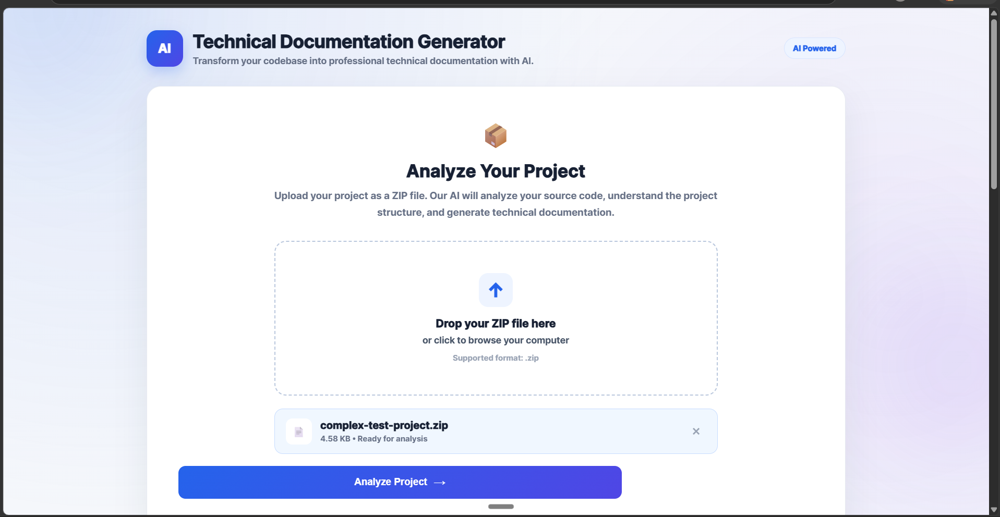
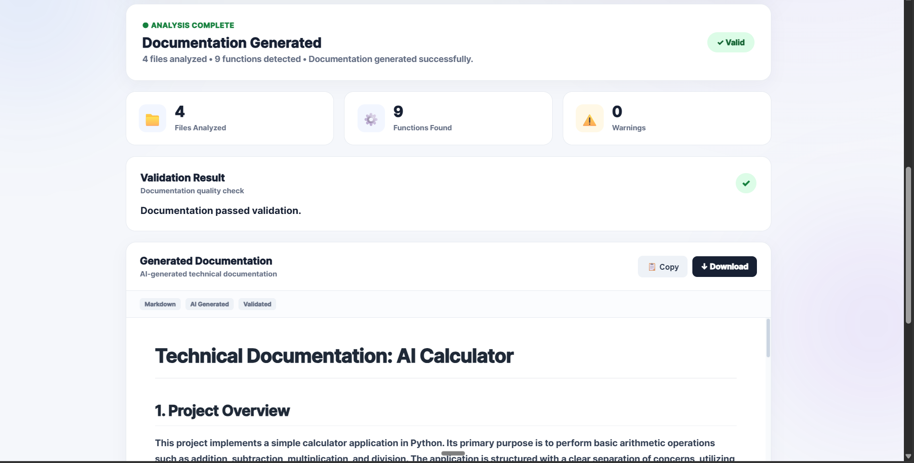
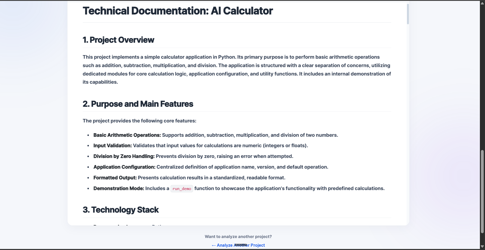

# AI Technical Documentation Generator

An AI-powered web application that analyzes uploaded Python codebases and automatically generates structured technical documentation using Google's Gemini API.

The project combines a Python/FastAPI backend with a simple web frontend to provide an end-to-end workflow for turning source code into readable technical documentation.

## 🚀 Features

* 📦 Upload a project as a ZIP file
* 🔍 Automatically analyze the uploaded codebase
* 🤖 Generate technical documentation using Gemini AI
* 📝 Generate structured Markdown documentation
* ✅ Validate generated documentation
* 👀 View generated documentation directly in the browser
* ⬇️ Download documentation as a Markdown file
* 🔐 Keep API credentials protected using environment variables

## 🏗️ Project Architecture

```text
ai-technical-documentation-generator/
│
├── backend/
│   ├── ai_engine.py
│   ├── analyzer.py
│   ├── main.py
│   ├── validator.py
│   ├── config.py
│   ├── utils.py
│   └── requirements.txt
│
├── frontend/
│   ├── index.html
│   ├── script.js
│   └── style.css
│
├── docs/
│   └── Generated documentation
│
├── test-project/
│   └── Sample project used for testing
│
├── .gitignore
└── README.md
```

## 🧠 How It Works

```text
User uploads ZIP
       ↓
Frontend sends project to backend
       ↓
Backend extracts and analyzes source files
       ↓
Codebase context is prepared
       ↓
Gemini AI generates documentation
       ↓
Generated documentation is validated
       ↓
Documentation is displayed
       ↓
User downloads Markdown file
```

## 🛠️ Technology Stack

### Backend

* Python
* FastAPI
* Uvicorn
* Google Gemini API

### Frontend

* HTML5
* CSS3
* JavaScript

### Other Tools

* Git & GitHub
* Python virtual environment
* Markdown

## 📸 Application Screenshots

### 1. Upload Project

The application allows users to upload their Python project as a ZIP file for analysis.



### 2. AI Documentation Generation

After analysis, the application displays the number of files analyzed, functions detected, validation status, and generated documentation.



### 3. Generated Technical Documentation

The generated technical documentation is displayed directly in the application and can be downloaded as a Markdown file.



## ⚙️ Setup and Installation

### 1. Clone the repository

```bash
git clone https://github.com/YOUR-USERNAME/ai-technical-documentation-generator.git
cd ai-technical-documentation-generator
```

### 2. Create a virtual environment

```bash
python -m venv venv
```

### 3. Activate the virtual environment

#### Windows

```powershell
venv\Scripts\activate
```

#### macOS / Linux

```bash
source venv/bin/activate
```

### 4. Install dependencies

```bash
pip install -r backend/requirements.txt
```

### 5. Configure the Gemini API key

Create a `.env` file inside the `backend` directory:

```env
GEMINI_API_KEY=your_api_key_here
```

Never commit your `.env` file to GitHub.

## ▶️ Running the Application

Navigate to the backend directory:

```bash
cd backend
```

Start the FastAPI server:

```bash
uvicorn main:app --reload
```

The backend will run locally and provide the API required by the frontend.

Open the frontend application in your browser and upload a ZIP file containing a Python project.

## 📄 Generated Documentation

The generated documentation can include information such as:

* Project overview
* Purpose and features
* Technology stack
* Project structure
* Module descriptions
* Code functionality
* Configuration details
* Usage information

The final documentation can be viewed in the application and downloaded as a Markdown file.

## 🧪 Testing

A sample project is included in the repository for testing the documentation generation workflow.

The application was tested using a sample Python codebase and successfully generated downloadable Markdown documentation.

## 🔐 Security

API credentials are stored using environment variables and are excluded from version control through `.gitignore`.

Do not expose or commit your Gemini API key.

## 🎯 Project Goals

This project demonstrates how generative AI can be integrated into a practical developer tool to automate technical documentation workflows.

It also demonstrates:

* AI API integration
* Backend API development
* Codebase analysis
* Prompt-based documentation generation
* Input validation
* Frontend-backend integration
* File upload and download handling

## 🔮 Future Improvements

Possible future enhancements include:

* Support for additional programming languages
* GitHub repository URL analysis
* Improved documentation templates
* Documentation export to PDF
* Automatic architecture diagrams
* Repository-wide documentation generation
* Authentication and user accounts
* Deployment to a cloud platform

## 👨‍💻 Author

**Pratik Prajapati**

Built as an AI/ML portfolio project focused on practical generative AI applications.

## ⭐ Project Status

**Completed and working**

The core workflow — codebase upload → analysis → AI documentation generation → validation → browser preview → Markdown download — has been successfully implemented and tested.
